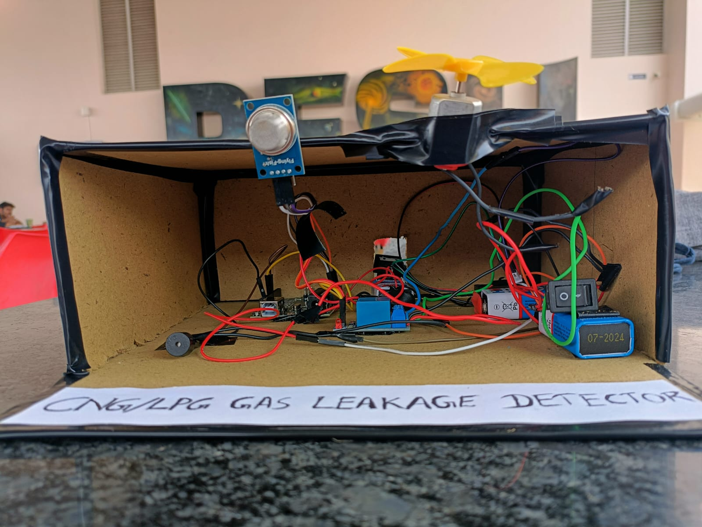
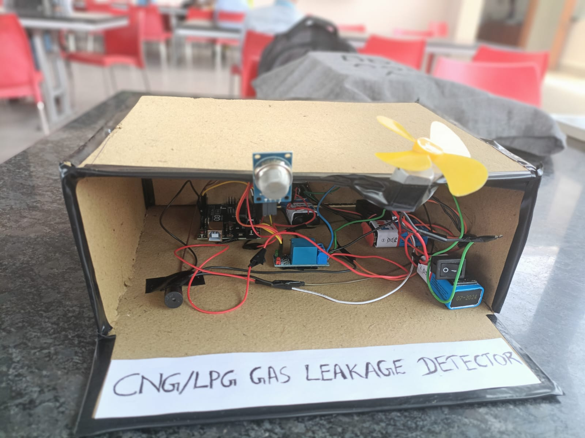

# CNG-LPG-Gas-Leakage-Detection-Project

This project is part of an academic assignment for the subject MPCA (Microprocessors and Computer Architecture). It focuses on detecting LPG (Liquefied Petroleum Gas) and CNG (Compressed Natural Gas) leaks using an Arduino Uno.

### Problem Statement for LPG-CNG Gas Leakage Detection System Using Arduino Uno

**Objective:**
To design and implement a real-time gas leakage detection system using an Arduino Uno that can effectively sense and alert the presence of LPG (Liquefied Petroleum Gas) and CNG (Compressed Natural Gas) leaks, ensuring safety in residential and industrial environments.

**Background:**
LPG and CNG are widely used as fuel sources in homes, vehicles, and various industrial applications. Despite their benefits, these gases are highly flammable and can pose significant risks if they leak into the environment. Early detection of gas leaks is crucial to prevent potential explosions, fires, and health hazards. Therefore, a reliable gas leakage detection system is necessary to provide timely warnings and enhance safety.

**System Requirements:**

1. **Gas Sensors:**
   - Utilize gas sensors (e.g., MQ-2, MQ-5, or MQ-6) capable of detecting LPG and CNG concentrations in the air.
   - The sensor should provide an analog output that can be read by the Arduino Uno.

2. **Microcontroller:**
   - Use an Arduino Uno to process the sensor data and control the output devices.

3. **Indicators and Alerts:**
   - Red LED: Indicates a gas leak.
   - Green LED: Indicates normal conditions (no leak).
   - Buzzer: Emits a sound to alert users when a gas leak is detected.
   - Serial Communication: Print status messages ("GAS LEAKING" or "NORMAL") to the Serial Monitor for monitoring purposes.

4. **Threshold Value:**
   - Set a threshold gas concentration level that, when exceeded, triggers the alert system.

5. **Power Supply:**
   - Ensure a stable power supply for the Arduino Uno and connected components.

**Design Specifications:**

1. **Hardware Components:**
   - Arduino Uno board
   - Gas sensor (e.g., MQ-2, MQ-5, or MQ-6)
   - LEDs (Red and Green)
   - Buzzer
   - Resistors (appropriate values for LEDs and sensors)
   - Breadboard and jumper wires

2. **Software Components:**
   - Arduino IDE for writing and uploading the code to the Arduino Uno.
   - Serial Monitor for real-time status monitoring.

**System Functionality:**

1. **Initialization:**
   - Configure the gas sensor, LEDs, and buzzer pins in the `setup()` function.
   - Initialize serial communication for debugging and monitoring purposes.

2. **Real-Time Monitoring:**
   - Continuously read the gas sensor output in the `loop()` function.
   - Compare the sensor value against the predefined threshold value.

3. **Alert Mechanism:**
   - If the sensor value exceeds the threshold:
     - Turn on the red LED.
     - Activate the buzzer.
     - Print "GAS LEAKING" to the Serial Monitor.
   - If the sensor value is below the threshold:
     - Turn off the red LED.
     - Deactivate the buzzer.
     - Turn on the green LED.
     - Print "NORMAL" to the Serial Monitor.

4. **Delay:**
   - Introduce a short delay between readings to stabilize the sensor output and prevent excessive serial output.

**Expected Outcome:**
The system should be able to detect gas leaks accurately and provide immediate visual and auditory alerts. The status messages displayed on the Serial Monitor will aid in real-time monitoring and troubleshooting. This project aims to enhance safety by providing an early warning system for LPG and CNG leaks, potentially preventing accidents and saving lives.

##Images of the Project
      